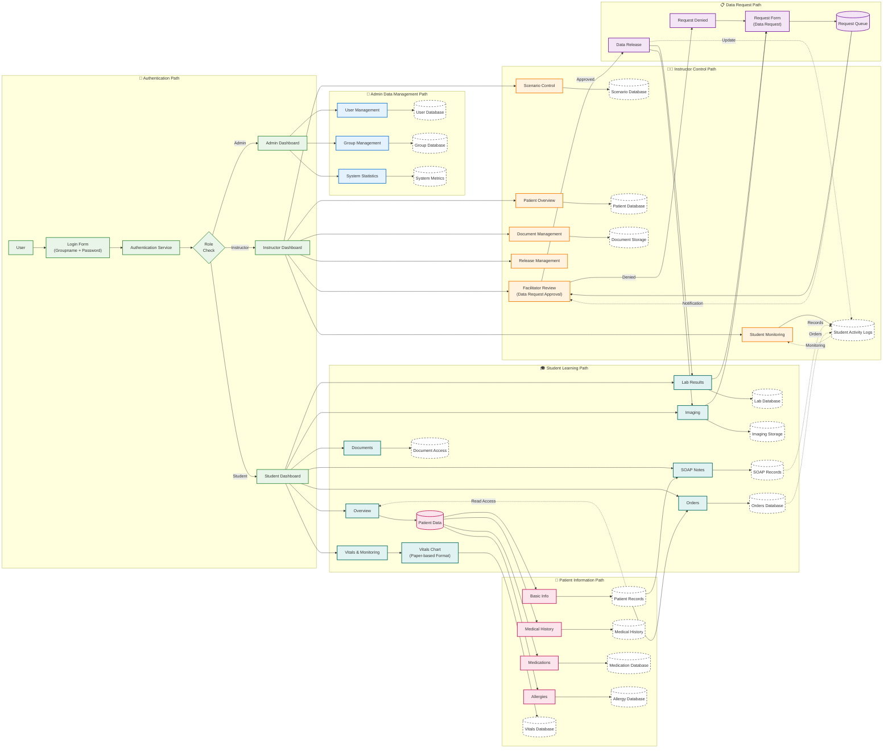
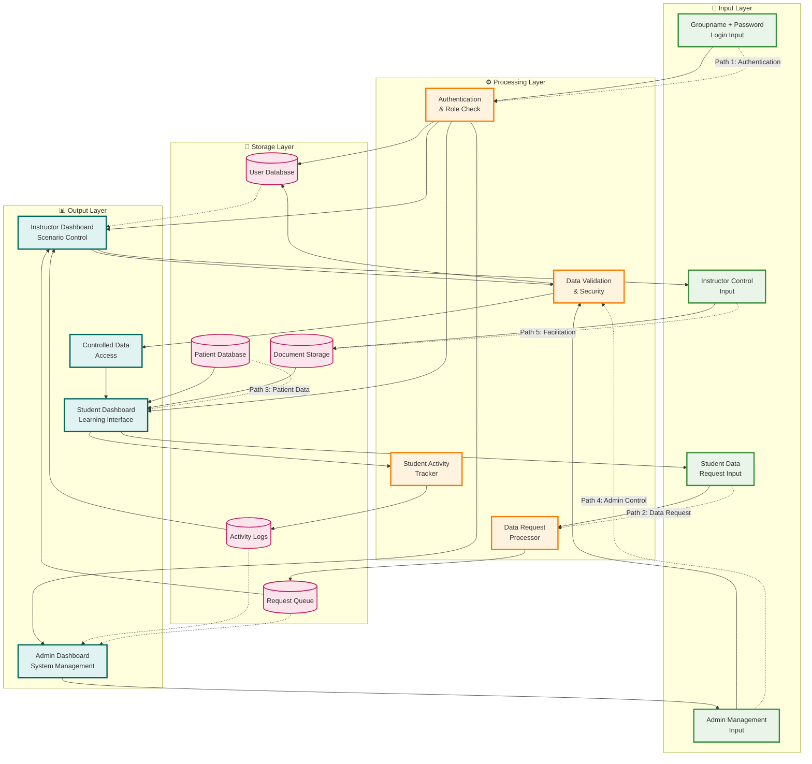

# MediSimv1 数据流图表
## Data Flow Diagrams

---

## 📋 文档概述

本文档基于MediSimv1的UI结构，展示了系统中各个组件之间的数据流动路径。图表按照不同的业务路径进行分类，清晰展示了用户操作、数据处理和信息传递的完整流程。

---

## 🌊 主要数据流路径图

### 完整的数据流架构

这个图表展示了系统中所有主要的数据流路径，包括认证、管理、教学和学习等不同的业务流程。

---

## 🛤️ 详细路径分析图

### 六大主要数据流路径

这个图表将系统的数据流分解为六个主要路径，每个路径代表一个完整的业务流程。

```mermaid
graph TD
    %% --- Path 1: Authentication & Authorization ---
    subgraph Path1["Path 1: 🔐 Authentication & Authorization"]
        direction TB
        P1_Start["User Login"] --> P1_Input["Groupname + Password Input"]
        P1_Input --> P1_Auth["Authentication Service"]
        P1_Auth --> P1_Role{"Role Determination"}
        P1_Role -->|Admin| P1_Admin["Admin Dashboard Access"]
        P1_Role -->|Instructor| P1_Instructor["Instructor Dashboard Access"]
        P1_Role -->|Student| P1_Student["Student Dashboard Access"]
    end

    %% --- Path 2: Admin Management ---
    subgraph Path2["Path 2: 👤 Admin Management"]
        direction TB
        P2_Start["Admin Dashboard"] --> P2_Users["User Management"]
        P2_Start --> P2_Groups["Group Management"]
        P2_Start --> P2_Stats["System Statistics"]
        
        P2_Users --> P2_UserDB[(User Database)]
        P2_Groups --> P2_GroupDB[(Group Database)]
        P2_Stats --> P2_MetricsDB[(Metrics Database)]
        
        P2_UserDB --> P2_UserOps["Create/Edit/Delete Users"]
        P2_GroupDB --> P2_GroupOps["Manage Group Memberships"]
        P2_MetricsDB --> P2_Reports["Generate System Reports"]
    end

    %% --- Path 3: Instructor Facilitation ---
    subgraph Path3["Path 3: 👨‍🏫 Instructor Facilitation"]
        direction TB
        P3_Start["Instructor Dashboard"] --> P3_Scenario["Scenario Selection & Control"]
        P3_Start --> P3_Monitor["Student Monitoring"]
        P3_Start --> P3_Patient["Patient Overview"]
        P3_Start --> P3_Documents["Document Management"]
        P3_Start --> P3_Approval["Data Request Approval"]
        
        P3_Scenario --> P3_ScenarioDB[(Scenario Database)]
        P3_Monitor --> P3_ActivityDB[(Student Activity Database)]
        P3_Patient --> P3_PatientDB[(Patient Database)]
        P3_Documents --> P3_DocumentDB[(Document Storage)]
        P3_Approval --> P3_RequestDB[(Request Queue Database)]
    end

    %% --- Path 4: Student Learning Core ---
    subgraph Path4["Path 4: 🎓 Student Learning Core"]
        direction TB
        P4_Start["Student Dashboard"] --> P4_Overview["Patient Overview"]
        P4_Start --> P4_Vitals["Vitals & Monitoring"]
        P4_Start --> P4_SOAP["SOAP Notes"]
        P4_Start --> P4_Orders["Orders"]
        P4_Start --> P4_Documents["Documents Access"]
        
        P4_Overview --> P4_PatientDB[(Patient Database)]
        P4_Vitals --> P4_VitalsDB[(Vitals Database)]
        P4_SOAP --> P4_SOAPDB[(SOAP Records Database)]
        P4_Orders --> P4_OrdersDB[(Orders Database)]
        P4_Documents --> P4_DocumentAccess[(Document Access Control)]
    end

    %% --- Path 5: Data Request Workflow ---
    subgraph Path5["Path 5: 📋 Data Request Workflow"]
        direction TB
        P5_Start["Student Requests Data"] --> P5_Lab["Lab Results Request"]
        P5_Start --> P5_Imaging["Imaging Request"]
        
        P5_Lab --> P5_Form["Request Form Submission"]
        P5_Imaging --> P5_Form
        
        P5_Form --> P5_Queue[(Request Queue)]
        P5_Queue --> P5_Review["Facilitator Review"]
        P5_Review -->|Approved| P5_Release["Data Release"]
        P5_Review -->|Denied| P5_Deny["Request Denied"]
        
        P5_Release --> P5_LabAccess["Lab Results Access"]
        P5_Release --> P5_ImagingAccess["Imaging Access"]
        P5_Deny --> P5_Feedback["Denial Feedback"]
    end

    %% --- Path 6: Patient Data Management ---
    subgraph Path6["Path 6: 🏥 Patient Data Management"]
        direction TB
        P6_Start["Patient Information"] --> P6_Basic["Basic Information"]
        P6_Start --> P6_History["Medical History"]
        P6_Start --> P6_Meds["Medications"]
        P6_Start --> P6_Allergies["Allergies"]
        P6_Start --> P6_Vitals["Vitals Chart (Paper Format)"]
        
        P6_Basic --> P6_PatientDB[(Patient Records Database)]
        P6_History --> P6_HistoryDB[(Medical History Database)]
        P6_Meds --> P6_MedsDB[(Medications Database)]
        P6_Allergies --> P6_AllergyDB[(Allergy Database)]
        P6_Vitals --> P6_VitalsDB[(Vitals Database)]
    end

    %% --- Inter-Path Connections ---
    P1_Student -.-> P4_Start
    P1_Instructor -.-> P3_Start
    P1_Admin -.-> P2_Start
    
    P4_PatientDB -.-> P6_PatientDB
    P4_VitalsDB -.-> P6_VitalsDB
    
    P5_Queue -.-> P3_Approval
    P3_Approval -.-> P5_Review
    
    P3_ActivityDB -.-> P4_SOAPDB
    P3_ActivityDB -.-> P4_OrdersDB
    
    P6_PatientDB -.-> P4_Overview
    P6_VitalsDB -.-> P4_Vitals

    %% --- Styles ---
    classDef path1Style fill:#e8f5e8,stroke:#388e3c,stroke-width:2px
    classDef path2Style fill:#e3f2fd,stroke:#1976d2,stroke-width:2px
    classDef path3Style fill:#fff3e0,stroke:#f57c00,stroke-width:2px
    classDef path4Style fill:#e0f2f1,stroke:#00695c,stroke-width:2px
    classDef path5Style fill:#f3e5f5,stroke:#7b1fa2,stroke-width:2px
    classDef path6Style fill:#fce4ec,stroke:#c2185b,stroke-width:2px
    classDef dbStyle fill:#fff,stroke:#666,stroke-width:2px,stroke-dasharray: 5 5

    %% Apply styles to paths
    class P1_Start,P1_Input,P1_Auth,P1_Role,P1_Admin,P1_Instructor,P1_Student path1Style
    class P2_Start,P2_Users,P2_Groups,P2_Stats,P2_UserOps,P2_GroupOps,P2_Reports path2Style
    class P3_Start,P3_Scenario,P3_Monitor,P3_Patient,P3_Documents,P3_Approval path3Style
    class P4_Start,P4_Overview,P4_Vitals,P4_SOAP,P4_Orders,P4_Documents path4Style
    class P5_Start,P5_Lab,P5_Imaging,P5_Form,P5_Review,P5_Release,P5_Deny,P5_LabAccess,P5_ImagingAccess,P5_Feedback path5Style
    class P6_Start,P6_Basic,P6_History,P6_Meds,P6_Allergies,P6_Vitals path6Style
    
    %% Database styling
    class P2_UserDB,P2_GroupDB,P2_MetricsDB,P3_ScenarioDB,P3_ActivityDB,P3_PatientDB,P3_DocumentDB,P3_RequestDB,P4_PatientDB,P4_VitalsDB,P4_SOAPDB,P4_OrdersDB,P4_DocumentAccess,P5_Queue,P6_PatientDB,P6_HistoryDB,P6_MedsDB,P6_AllergyDB,P6_VitalsDB dbStyle
```

---

## 🔄 简化数据流概览图

### 四层架构的数据流

这个简化版本突出显示了系统的四层架构（输入层、处理层、存储层、输出层）和五个主要数据流路径。

---

## 📊 路径分析总结

### 五大核心数据流路径

#### Path 1: 🔐 Authentication & Authorization
- **起点**: 用户登录 (Groupname + Password)
- **处理**: 身份验证和角色确定
- **终点**: 基于角色的仪表板访问
- **关键特点**: 安全验证、角色分配

#### Path 2: 👤 Admin Management  
- **起点**: 管理员仪表板
- **处理**: 用户管理、组管理、系统统计
- **终点**: 系统配置和报告生成
- **关键特点**: 系统级权限、全局管理

#### Path 3: 👨‍🏫 Instructor Facilitation
- **起点**: 教师仪表板
- **处理**: 场景控制、学生监控、数据请求审批
- **终点**: 教学活动管理和学生指导
- **关键特点**: 教学控制、学生监督

#### Path 4: 🎓 Student Learning Core
- **起点**: 学生仪表板
- **处理**: 患者数据查看、SOAP笔记编写、医嘱下达
- **终点**: 学习记录和临床技能练习
- **关键特点**: 学习体验、技能培养

#### Path 5: 📋 Data Request Workflow
- **起点**: 学生数据请求
- **处理**: 请求提交、教师审批、数据释放
- **终点**: 受控的数据访问
- **关键特点**: 权限控制、教育渐进性

### 关键设计特点

#### 数据安全与权限控制
- **分层验证**: 多层次的身份验证和授权
- **角色隔离**: 基于角色的数据访问控制
- **审批流程**: 学生数据请求需要教师审批

#### 教育流程优化
- **渐进式学习**: 通过数据请求控制学习进度
- **实时监控**: 教师可以实时监控学生活动
- **记录追踪**: 完整的学习活动记录和追踪

#### 系统架构优势
- **模块化设计**: 清晰的功能模块分离
- **可扩展性**: 易于添加新的功能模块
- **数据一致性**: 统一的数据管理和存储

---

## 🔗 相关文档

- [UI可视化图表](./ui-mermaid-diagrams.md) - 完整的UI结构图
- [系统架构图](./mvp-architecture.puml) - 技术架构设计
- [数据隔离架构](./data-isolation-architecture.md) - 数据安全设计

---

**文档版本**: v1.0  
**最后更新**: 2025年1月  
**创建工具**: Mermaid.js  
**基于**: MediSimv1 UI结构设计
