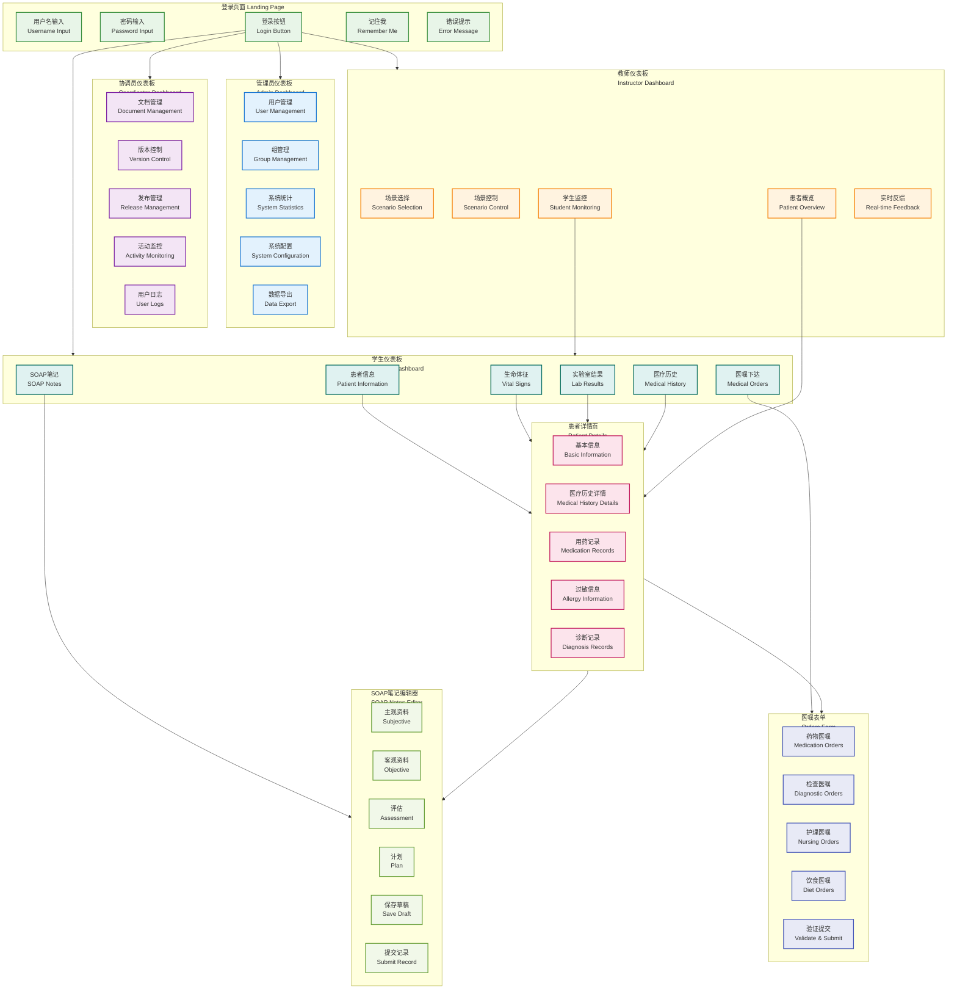
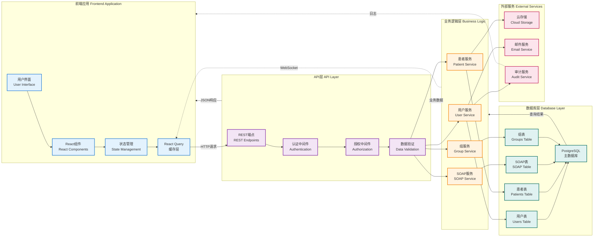
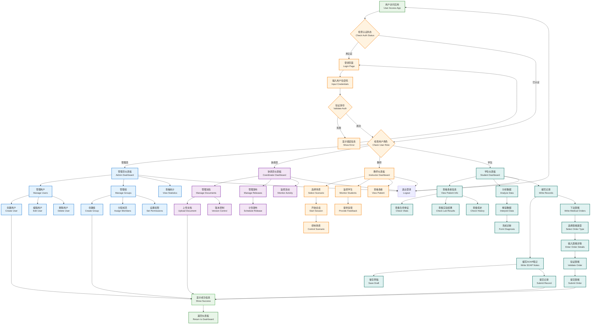

# MediSimv1 UI Mermaid 可视化图表
## UI Visualization with Mermaid Diagrams

---

## 📋 文档概述

本文档包含了MediSimv1数字医疗记录仿真平台的UI可视化图表，使用Mermaid语法绘制，展示了用户界面结构、组件关系、数据流和用户交互流程。

---

## 🎨 UI结构和页面导航图

### 主要页面和功能模块

---

## 🏗️ UI组件关系图

### React组件架构和依赖关系

```mermaid
graph TD
    subgraph App["主应用 Main App"]
        AppRoot["App.tsx<br/>应用根组件"]
        GlobalProviders["全局提供者<br/>Global Providers"]
        Router["路由系统<br/>Router System"]
        AuthGuard["认证守卫<br/>Auth Guard"]
    end

    subgraph SharedComponents["共享组件 Shared Components"]
        TopNav["顶部导航<br/>Top Navigation"]
        Sidebar["侧边栏<br/>Sidebar"]
        PatientList["患者列表<br/>Patient List"]
        PatientCard["患者卡片<br/>Patient Card"]
        NotificationToast["通知Toast<br/>Notification Toast"]
        LoadingSpinner["加载指示器<br/>Loading Spinner"]
    end

    subgraph UIComponents["UI基础组件 UI Components"]
        Button["按钮<br/>Button"]
        Input["输入框<br/>Input"]
        Card["卡片<br/>Card"]
        Dialog["对话框<br/>Dialog"]
        Table["表格<br/>Table"]
        Tabs["选项卡<br/>Tabs"]
        Form["表单<br/>Form"]
        Select["选择器<br/>Select"]
    end

    subgraph Hooks["自定义Hooks Custom Hooks"]
        useAuth["认证Hook<br/>useAuth"]
        usePatient["患者Hook<br/>usePatient"]
        useToast["通知Hook<br/>useToast"]
        useMobile["移动端Hook<br/>useMobile"]
        useLocalStorage["本地存储Hook<br/>useLocalStorage"]
    end

    subgraph StateManagement["状态管理 State Management"]
        QueryClient["查询客户端<br/>Query Client"]
        AuthContext["认证上下文<br/>Auth Context"]
        GlobalState["全局状态<br/>Global State"]
        LocalCache["本地缓存<br/>Local Cache"]
    end

    subgraph AdminPages["管理员页面 Admin Pages"]
        AdminDash["管理员仪表板<br/>Admin Dashboard"]
        UserManagement["用户管理<br/>User Management"]
        GroupManagement["组管理<br/>Group Management"]
        SystemSettings["系统设置<br/>System Settings"]
    end

    subgraph StudentPages["学生页面 Student Pages"]
        StudentDash["学生仪表板<br/>Student Dashboard"]
        PatientView["患者查看<br/>Patient View"]
        SOAPNotes["SOAP笔记<br/>SOAP Notes"]
        MedicalOrders["医嘱下达<br/>Medical Orders"]
    end

    %% 应用结构关系
    AppRoot --> GlobalProviders
    AppRoot --> Router
    Router --> AuthGuard
    
    %% 页面组件关系
    AuthGuard --> AdminPages
    AuthGuard --> StudentPages
    
    %% 共享组件使用
    AdminDash --> TopNav
    AdminDash --> Sidebar
    AdminDash --> PatientList
    StudentDash --> TopNav
    StudentDash --> PatientCard
    
    %% UI组件使用
    UserManagement --> Table
    UserManagement --> Button
    UserManagement --> Dialog
    SOAPNotes --> Form
    SOAPNotes --> Input
    SOAPNotes --> Button
    
    %% Hook使用关系
    TopNav --> useAuth
    PatientView --> usePatient
    NotificationToast --> useToast
    AdminDash --> useMobile
    
    %% 状态管理关系
    useAuth --> AuthContext
    usePatient --> QueryClient
    GlobalProviders --> QueryClient
    GlobalProviders --> AuthContext
    
    %% 数据流
    PatientList --> PatientView
    PatientView --> SOAPNotes
    PatientView --> MedicalOrders
    UserManagement --> GroupManagement

    %% 样式定义
    classDef appStyle fill:#e3f2fd,stroke:#1976d2,stroke-width:2px
    classDef sharedStyle fill:#f3e5f5,stroke:#7b1fa2,stroke-width:2px
    classDef uiStyle fill:#fff3e0,stroke:#f57c00,stroke-width:2px
    classDef hookStyle fill:#e0f2f1,stroke:#00695c,stroke-width:2px
    classDef stateStyle fill:#fce4ec,stroke:#c2185b,stroke-width:2px
    classDef adminStyle fill:#f1f8e9,stroke:#689f38,stroke-width:2px
    classDef studentStyle fill:#e8eaf6,stroke:#3f51b5,stroke-width:2px

    class AppRoot,GlobalProviders,Router,AuthGuard appStyle
    class TopNav,Sidebar,PatientList,PatientCard,NotificationToast,LoadingSpinner sharedStyle
    class Button,Input,Card,Dialog,Table,Tabs,Form,Select uiStyle
    class useAuth,usePatient,useToast,useMobile,useLocalStorage hookStyle
    class QueryClient,AuthContext,GlobalState,LocalCache stateStyle
    class AdminDash,UserManagement,GroupManagement,SystemSettings adminStyle
    class StudentDash,PatientView,SOAPNotes,MedicalOrders studentStyle
```

---

## 🔄 数据流架构图

### 前端到后端的数据流向

---

## 👥 用户交互流程图

### 完整的用户操作流程

---

## 🎯 UI设计特点总结

### 核心设计原则

#### 1. 角色导向设计
- **四角色界面**: 管理员、协调员、教师、学生专用界面
- **权限控制**: 基于角色的功能访问控制
- **工作流优化**: 针对不同角色的工作流程设计

#### 2. 组件化架构
- **可重用组件**: 高度模块化的UI组件系统
- **一致性设计**: 统一的设计语言和交互模式
- **类型安全**: 完整的TypeScript类型定义

#### 3. 响应式设计
- **多设备适配**: 桌面、平板、移动端响应式布局
- **触控优化**: 移动端友好的交互设计
- **可访问性**: 符合WCAG 2.1 AA标准

#### 4. 现代化技术栈
- **React 18**: 并发特性和性能优化
- **TypeScript**: 类型安全和开发体验
- **shadcn/ui**: 现代化UI组件库
- **Tailwind CSS**: 原子化CSS框架

### 用户体验特点

#### 直观的导航系统
- 清晰的页面层级结构
- 面包屑导航支持
- 快速访问常用功能

#### 高效的数据展示
- 分页和虚拟化支持
- 实时数据更新
- 智能搜索和过滤

#### 友好的交互反馈
- 实时表单验证
- 操作状态指示
- 错误处理和恢复

---

## 📞 技术支持

如需查看或编辑这些Mermaid图表：

1. **在线编辑器**: 复制代码到 [Mermaid Live Editor](https://mermaid.live/)
2. **VS Code**: 安装Mermaid Preview插件
3. **GitHub/GitLab**: 直接在Markdown中渲染
4. **文档系统**: 集成到Docusaurus、GitBook等文档系统

---

**文档版本**: v1.0  
**最后更新**: 2025年1月  
**创建工具**: Mermaid.js  
**兼容性**: 支持所有主流Mermaid渲染器
